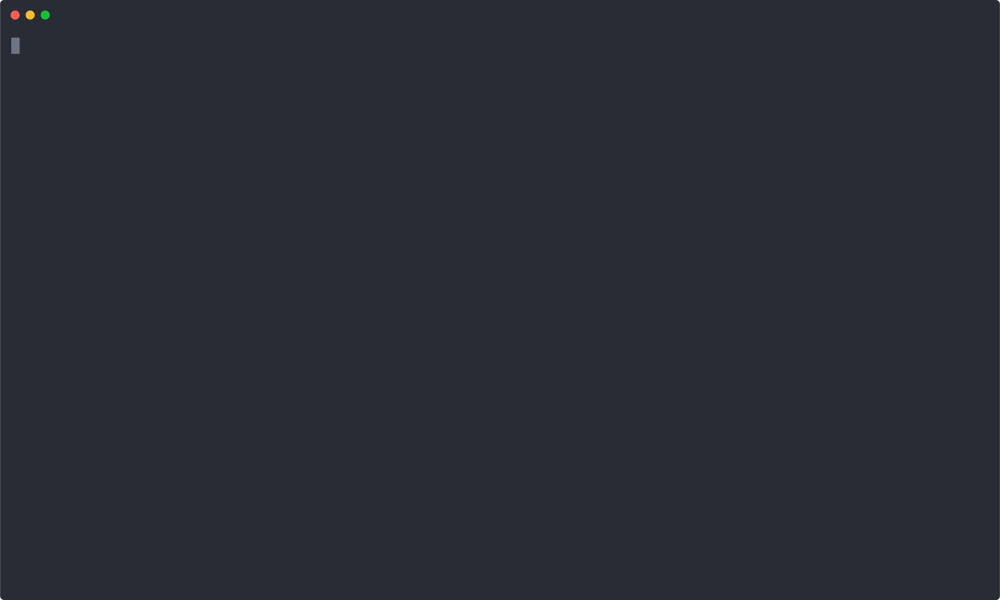

OpenStack shell creds helper
============================
This is a tool to make managing OpenStack credentials easier, to be used in
combination with included shell function scripts (and completion files) for
bash and fish.

It is written in Go and supports the following Keystone authentication types:
* Password (scoped and unscoped)
* Password + TOTP
* Application Credential

This scan your password store directory for any passwords ending in `.openrc`
and will display them in a list for you to choose.

The list is powered by the `fzf` tool, which is natively included in the
binary. This allows powerful auto-complete functionality and should make it
super quick to get the credentials you need loaded fast.

It supports openrc files that don't specify a project, and in those cases will
request a list of projects you're a member of from Keystone and allow you to
choose, saving you from duplicating credentials if you're a member of lots of
projects.

This tool also has preliminary support for TOTP, so for accounts that have a
registered TOTP secret, it can prompt for your 6-digit TOTP code (e.g.
Google Authenticator, Yubikey OATH) before requesting a token from Keystone.

After loading your credentials and making a request to Keystone, the tool will
then set some environment variables for you to make subsequent OpenStack API
calls, with the token auth method.


Demo
----
<p align="center"></p>


Use
---
The shell function scripts in this repository provide the following commands:

  * `chcreds` to select and load credentials as username/password in the current environment
  * `recreds` to reload the current credential, which is useful if your token expires
  * `rmcreds` to clear the current credentials from your current environment
  * `prcreds` to print the current credentials


How it works
-------------
The `chcreds` function will call out to the `oscreds` binary to present the list
of credentials available.

Once a credential is chosen, `oscreds` will call out to `pass` to actually
decrypt and return the contents to `oscreds`.

`oscreds` will then interpret the credentials and make subsequent API calls to
Keystone to eventually return an OpenStack token.

The shell function scripts will load the appropriate environment variable for
OpenStack CLI tools to work (almost) seamlessly.

Optionally, you can display your currently loaded credentials in your prompt:

**Bash** — add `${OS_CRED:+ \[$OS_CRED\]}` to your `PS1` var. For example (coloured):

```
    PS1='\[\033[01;32m\]\u@\h\[\033[01;34m\] \w\[\033[01;33m\]${OS_CRED:+ \[$OS_CRED\]}\[\033[00m\] \$ '
```

**Fish** — add the following to your `fish_prompt` function:

```
    if set -q OS_CRED
        printf ' [%s]' $OS_CRED
    end
```


Using token auth
----------------
Using a Keystone token auth directly seems to works well with:
* OpenStack client
* OpenStack APIs

Some known exceptions are documented below:

### Swiftclient

The swiftclient doesn't work directly, but can work with a token by specifying
`--os-auth-token` and `--os-storage-url` directly, where the storage URL is
found from the OpenStack catalog.

```
OS_STORAGE_URL=$(openstack catalog show object-store -f json | jq -r '.endpoints[] | select(.interface=="public" and .region=="Melbourne") | .url')
swift --os-auth-token $OS_TOKEN --os-storage-url $OS_STORAGE_URL
```

Installation
------------
You can grab the latest build from the GitHub project releases page, or see
below for instructions on building it yourself.

Once you have the `oscreds` binary, put it somewhere in your path
(e.g. `~/.local/bin`)

``` sh
    mkdir -p ~/.local/bin
    cp oscreds ~/.local/bin/
```

### Bash

Grab a copy of the `bash-functions` file from this repo
and drop it into your `.bashrc.d` (or similar) or source it from your `.bashrc`
to load automatically in your shell.

### Fish

Source the `fish-functions` file from your `~/.config/fish/config.fish`:

``` sh
    source /path/to/fish-functions
```

Or copy the individual functions into `~/.config/fish/functions/` as
autoloaded `.fish` files (e.g. `~/.config/fish/functions/chcreds.fish`).

Adding credentials
------------------
Add your OpenStack openrc credentials files into pass, ensuring they have a
.openrc extension for oscreds to find them.

``` sh
    pass insert -m my-password.openrc
```

You can then arrange the files in your password store in a way that is
appropriate for your use.

Credential examples
-------------------

Standard password auth
``` sh
    export OS_AUTH_URL=https://keystone.domain.name/
    export OS_PROJECT_NAME=myproject
    export OS_USERNAME=username
    export OS_PASSWORD=password
```

Application credential
``` sh
    export OS_AUTH_URL=https://keystone.domain.name/
    export OS_AUTH_TYPE=v3applicationcredential
    export OS_APPLICATION_CREDENTIAL_ID=app_cred_id
    export OS_APPLICATION_CREDENTIAL_SECRET=app_cred_secret
```

You can also omit any `OS_PROJECT_NAME` or `OS_PROJECT_ID` to optionally
request a list of projects that you have roles assigned to choose from.

``` sh
    export OS_AUTH_URL=https://keystone.domain.name/
    export OS_USERNAME=username
    export OS_PASSWORD=password
```

To enable TOTP functionality (if password + TOTP is enabled for identity)
then you need to append `OS_TOTP_REQUIRED=true` to your openrc to trigger
the TOTP prompt.

``` sh
    export OS_AUTH_URL=https://keystone.domain.name/
    export OS_PROJECT_NAME=myproject
    export OS_PROJECT_ID=1234567890abcdef
    export OS_USERNAME=username
    export OS_PASSWORD=password
    export OS_USER_DOMAIN_NAME=Default
    export OS_PROJECT_DOMAIN_NAME=Default
    export OS_TOTP_REQUIRED=true
```

Shell completion
----------------
Completion scripts for both bash and fish are included.

### Bash

To install it for your user, the following should work:

``` sh
    mkdir -p ~/.local/share/bash-completion/completions
    cp bash-completion ~/.local/share/bash-completion/completions/chcreds
```

### Fish

To install it for your user, copy the completion file to your fish completions directory:

``` sh
    mkdir -p ~/.config/fish/completions
    cp fish-completion ~/.config/fish/completions/chcreds.fish
```

You can then use tab completion to complete the filename of the credentials file.

Building
--------
A simple `go build` should suffice to compile the binary.
